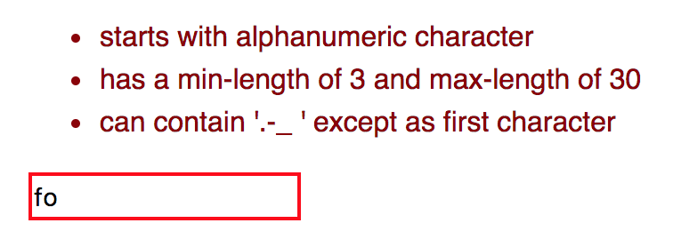

# JavaScript-Regex-Validators

<a href="https://jannicz.github.io/my-regex-validators/">
  <strong>See Validator Demo and Examples</strong>
</a>

<p>
  
</p>

## Usage
Include the validation script
```html
<script src="validation.js"></script>
```

Either pass the validator functions into the validator lib or include it
```html
<script src="regex-validators.js"></script>
```
```javascript
valFunctions: { valudationFn: function() {...} }
```

Can be used for frontend validation of following input fields:

## Numbers
- digital place separator
- valid date
- maximum/minimum date
- valid time

## Strings
- username characters
- password characters
- password complexity
- email validity

